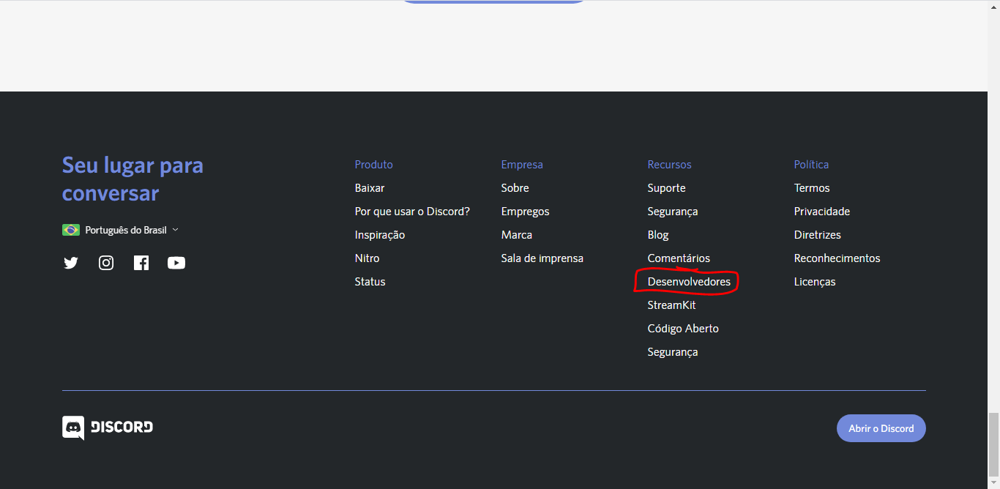
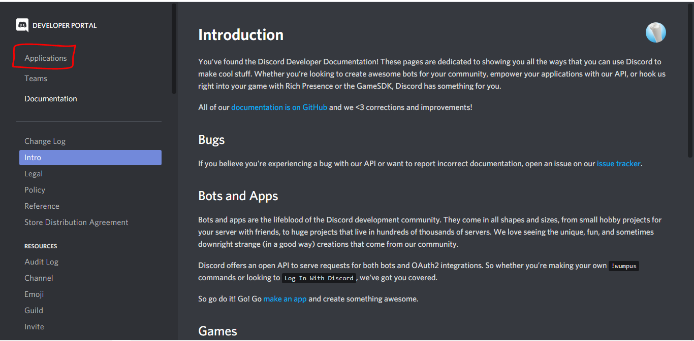
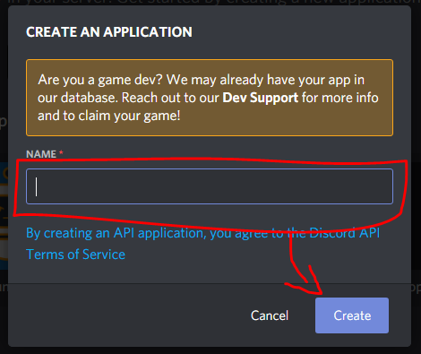
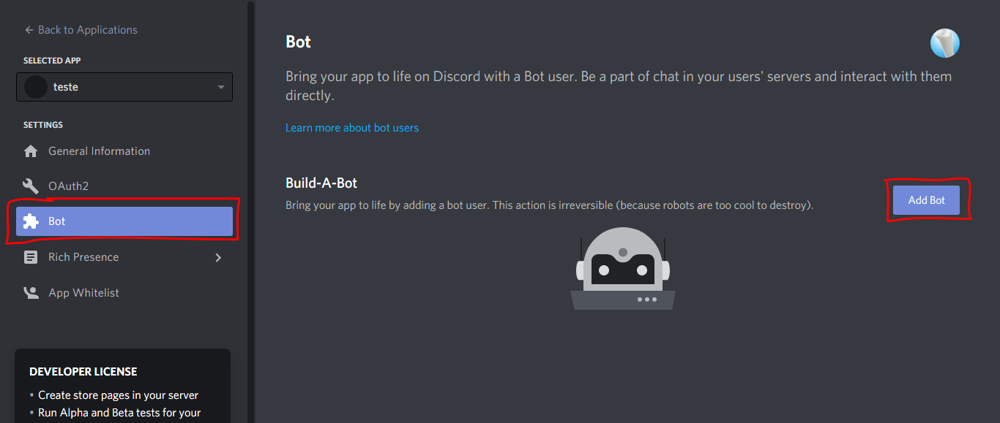
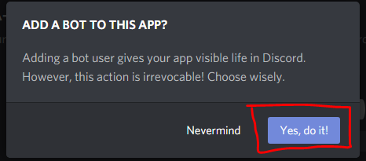
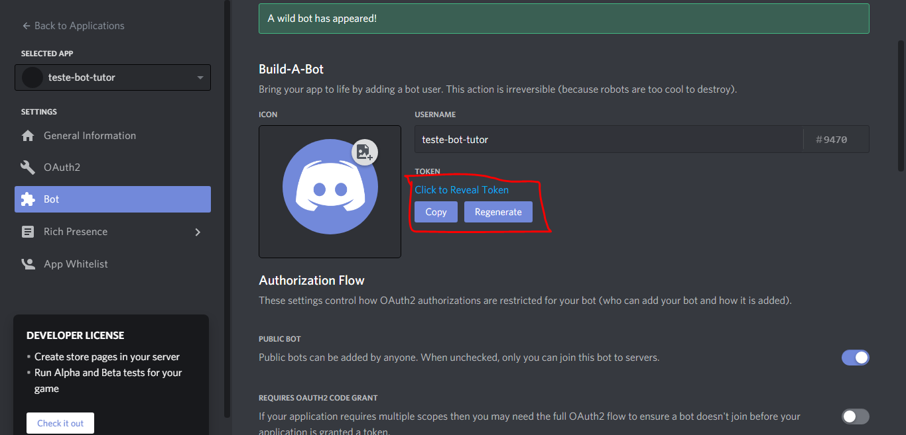

# Coffe

[Português](#Português) |
[English](#English)

## Português
Um Bot para o Discord de código aberto, que usa a biblioteca [Discord.js](https://discord.js.org/#/)!

### Aviso
**Antes de tudo, para seu bot funcionar corretamente, entre no arquivo *index.js* e modifique a linha de número 3:**
```js
const config = require("./info.json");
```
para:
```js
const config = require("./config.json");
```

#### Links
[Como usar](#Como-usar) |
[Criando bot no Discord](#Criando-bot-no-discord)

### Como usar?
Para rodar o bot na sua máquina, primeiramente você deve ter instalado o **Node js**, e ter [criado um bot na área de desenvolvedor do Discord](#Criando-bot-no-discord).
Após esses dois passos concluídos, copie o *token* do seu bot, e cole na área reservada para o token no arquivo **config.json** dentro dos arquivos do bot.
Neste mesmo arquivo **config.json**, você vai perceber que existe uma informação que se chama: 
```json
"logPrincipal": "Id da sala que você deseja que seja o log do seu bot"
```
você vai preencher ela com o ID de algum canal de texto de algum servidor (O bot deve estar neste servidor e ter permissão para enviar mensagens!), recomendo que você crie um servidor próprio para o Bot e crie um canal de log.
Coloque seu ID na área que lhe é reservada no mesmo arquivo *config.json*!

Se você estiver utilizando o **Visual Studio Code** como editor de códigos, nele abra a pasta do bot, em seguida abra o terminal, e execute dentro do terminal o seguinte comando:
```
node index.js
```

E pronto, seu bot ficará online, mostrando no terminal a quantidade de pessoas, de servidores e de canais, também vai ser exibida uma lista com o nome de todos os servidores que o bot está presente!

**LEMBRE-SE que seu bot só ficará online enquanto sua máquina estiver ligada, ou até o momento que você parar de rodar o bot (pode usar *"CTRL + C"* dentro do terminal para parar o bot).**

### Criando bot no discord
Você precisa criar uma aplicação no discord para que o código tenha onde "rodar". Se não sabe fazer isso siga esses passos:

1. Acesse o [site oficial do discord](https://discord.com/new)
2. Procure a *"Área de desenvolvedores"*
    
3. Dentro do portal do Desenvolvedor clique em *"Applications"/"Aplicações"*!
    
4. Clique em *"New Applications"/"Nova aplicação"*
    
5. Coloque o nome do seu bot e clique em *"Create"/"Criar"*
    
6. Do lado esquerdo, clique em *"Bot"*, logo em seguida em *"Add Bot"* e confirme!
    
    
7. Pronto! Seu bot foi criado, agora copie o **Token** e cole no **config.json** do seu bot!
    


[...]README INCOMPLETO

---

## English
An open source Discord Bot, using the [Discord.js](https://discord.js.org/#/) library!

### How to use?
To run the bot on your machine, you must first have installed **Node js**, and [created a bot in the Discord developer area](#Creating-bot-on-discord).
After these two steps are completed, copy the *token* of your bot, and paste it in the area reserved for the token in the **config.json** file inside the bot files.
If you find it necessary to enter your ID, place it in the area reserved for you in the same *config.json* file.

If you are using **Visual Studio Code** as a code editor, open the bot folder there, then open the terminal, and run the following command inside the terminal:
```
node index.js
```

And ready, your bot will be online, showing in the terminal the amount of people, servers and channels, it will also be displayed a list with the name of all the servers that the bot is present!

**REMEMBER that your bot will only be online while your machine is on, or until the moment you stop running the bot (you can use *"CTRL + C"* inside the terminal to stop the bot).**

[...]INCOMPLETE RADME
